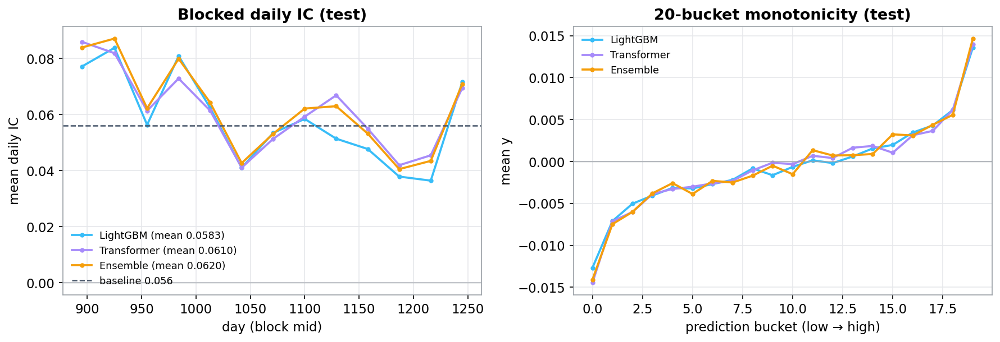

# eg-model — From Ridge / LightGBM / MLP Baselines to an Ensemble and an Optimized Temporal Transformer

Predicting a **weak forward return `y` on a cross-sectional daily panel** — the
Engineering Gates take-home — carried from linear baselines through a robust
ML ensemble to a **temporal + cross-sectional Transformer** (then optimized with
R-Drop + architectural scale-up), under one leak-free, forward-in-time protocol.
The final model runs on **263 leak-free features** (213 base + 50 funnel-curated factors).

> 📄 **Read the full write-up (bilingual, self-contained):
> [https://autoalpha.cn/eg_model/](https://autoalpha.cn/eg_model/)**
> — task & data, feature engineering, the model ladder, the Transformer design &
> optimizations (§3.3), the ensemble, results, and the **Task 2** order-book /
> tick-signal answer. Static copies live in this repo:
> [`summary.html`](summary.html) and the clickable [`factor_library.html`](factor_library.html).

The raw `data.csv` is intentionally **not** included (per the take-home NDA).

---

## Headline results (test = days 881–1259, the baseline's eval window)

Metric = **mean daily cross-sectional Pearson IC** (primary) and Spearman IC
(secondary), with the mean/std of daily IC (IR) as a stability check.

| Model | Pearson IC | Spearman | IR |
| --- | ---: | ---: | ---: |
| Reference baseline `y_hat0` | 0.0560 | — | 1.10 |
| Ridge / ElasticNet (linear) | ~0.047 | ~0.052 | 0.67–0.73 |
| LightGBM-DART / Huber / L1 (seed-bag) | 0.0567–0.0584 | ~0.062 | 1.03–**1.08** |
| MLP (multi-task, 8-seed) | 0.0598 | 0.0619 | 0.94 |
| **Temporal Transformer (§3.3-optimized, 8-seed)** | **0.0612** | 0.0624 | 1.00 → **1.12** processed |
| **ML Ensemble (equal-weight blend)** | **0.0621** | **0.0643** | 1.06 |
| **ML Ensemble (diversity-weight + group-neutral, production)** | 0.0617 | 0.0647 | **1.144** |

The Transformer and the Ensemble both **beat the provided `y_hat0`** on the primary
metric — the equal-weight Ensemble by **+10.9%** on Pearson IC. Linear models
plateau at ~0.047, showing the extractable signal is **nonlinear / interaction-based**.
After further processing (diversity weighting + group-neutralization), IR is lifted
past the 1.1 baseline while IC holds.

<p align="center"></p>
<p align="center"><sub><b>Cross-model comparison (test, 263 features).</b> Left: mean daily Pearson IC (dashed = baseline 0.056). Right: IC information ratio (dashed = baseline 1.1). Ensemble* / Transformer* are the further-processed final models.</sub></p>

---

## Data & the metric

- **Panel.** `day` 1–1259 (time-ordered) × `instrument_id`; ≈1.68M rows, 1,333
  instruments, ~74 groups (`g`, `-1` = unclassified). Near-rectangular: nearly every
  instrument on every day — which enables clean **per-instrument temporal sequences**.
- **Columns.** 86 anonymous factors `x_0…x_85`, 5 price columns `prc1…prc5`, a
  volume `vol0`, the group id `g`, and the target `y` (forward, mean ≈ 0).
- **Score.** `score = mean_d corr(y_hat[d], y[d])` — correlation **within each day**,
  averaged over days. Optimise the Pearson IC; keep it stable (IR).
- **Split.** train `1–760` / valid `761–880` (selection, early-stop) / test
  `881–1259` (scored once). `y_hat0` scores IC 0.056 / IR 1.1 on the test window.

## Features — 263 leak-free features (213 base + 50 curated)

Because scoring is a per-day cross-sectional IC, the workhorse is the **per-day
cross-sectional z-score**. All temporal ops use `shift()>=0` within an instrument;
all cross-sectional ops use only the same day.

**213 base features:**
1. **CS z-score of all 86 `x`** (clip ±6) — removes per-day level/scale, the key denoiser.
2. **Temporal (per instrument):** `y` lags / rolling mean / rolling vol / EWMA; lag1 /
   5-day momentum / 10-day mean of the strongest 30 `x`'s.
3. **Price/volume:** `prc1…5` → mean/std/range/spread/skew & momentum; `vol0` change.
4. **Group (`g`):** lagged group return, and an **expanding-window target encoding**
   (up to the previous day — leak-free).
5. **Cross-sectional PCA (12)** — common factors that suppress idiosyncratic noise.

**+ 50 curated factors:** mined from the raw `prc1…prc5` / `vol0` columns and screened
through a **three-stage forward funnel** (discovery on train ≤760 → val gate 761–820 →
strict conf gate 821–880, with the test window sealed throughout), keeping only factors
with a genuine marginal contribution inside a real model. Formulas, IC, and max/mean
correlation for all 263 features are in the clickable [`factor_library.html`](factor_library.html).

## Models

- **Linear** — Ridge / ElasticNet. Plateau ~0.047 ⇒ signal is nonlinear.
- **LightGBM** — robust **L1 / Huber / DART** objectives on the z-scored target,
  seed-bagged. DART is the steadiest (IR ~1.08).
- **MLP** — DCN-style cross + deep tower, **multi-task** heads (`y_xs` + `sign(y)` +
  `|y_xs|`), 8-seed, daily-IC early stopping (0.0598).
- **Temporal Transformer** — per-`(instrument, day)` sequences of the last **K=32
  days**; input projection + causal conv stem, **time-biased attention**, SwiGLU +
  LayerScale, last-token + attention dual readout, multitask head, 8-seed ensemble.
  **§3.3 optimizations** lift it from 0.0602 to **0.0612**: **R-Drop** twin-dropout
  consistency (variance ↓ → IR ↑) + **architectural scale-up** (width 128→176, depth
  3→4) + **stochastic depth** (capacity ↑ with variance held). The strongest single
  model and the most decorrelated from the trees.
- **Ensemble** — each model **per-day z-scored** (preserves Pearson IC; *not* ranked),
  LightGBM variants averaged into one family, then an **inverse-correlation diversity
  weighting** over the decorrelated members `{LightGBM, MLP, Transformer}` followed by a
  partial group-`g` neutralization. **Linear models are excluded from the blend** (too
  weak at ~0.047; adding them only drags IC down — verified). Production composition:
  **DART 45.5% + MLP 26.8% + Transformer(v2) 27.7%** (the redundant Huber/L1 are driven
  to 0 by the diversity weighting).

<p align="center">
  
  
</p>
<p align="center"><sub>Left: base-model prediction correlation (Transformer↔LightGBM least correlated at ~0.84 — the main source of blend gain). Right: ensemble lift over the best single model.</sub></p>

<p align="center"></p>
<p align="center"><sub>LightGBM vs Transformer vs Ensemble (test): blocked ≈monthly IC (Ensemble 0.0621 &gt; Transformer 0.0612 &gt; LightGBM 0.0584) and 20-bucket monotonicity (realized <code>y</code> rises monotonically across prediction buckets).</sub></p>

---

## Repository layout

| Path | Content |
| --- | --- |
| `tools/build_features.py` | leak-free feature pipeline → 213 base features |
| `ML_single/scripts/` | `run_classic.py` (Ridge/ElasticNet/LightGBM), `run_mlp.py` |
| `Transformer/v1/scripts/` | base v3-lineage temporal Transformer |
| `Transformer/v2/` | **§3.3-optimized Transformer** — model code (`run_transformer_opt.py`: R-Drop + scale-up + stochastic depth), pipeline, ablation scripts, predictions, `reports/README.md`, `metrics/results.json` |
| `ML_ensemble/scripts/` | per-day z-score blend + diversity weighting + neutralization |
| `tools/gen_figs.py` | report figures → `summary_assets/` |
| `summary_src.html` / `summary.html` | bilingual report (editable source / self-contained build) |
| `factor_library.html` | clickable table of all 263 features (formula + IC + correlations) |
| `report/task2_section.html` | Task 2 — order-book / tick-signal answer |
| `submit/` | deployable, all-data-trained OOS scoring package (see below) |

## Reproduce

```bash
cd /root/autodl-tmp/eg_model
python tools/build_features.py                      # 213 base features
# + mine & merge the 50 curated factors -> 263-feature set (see factor_library.html)
python ML_single/scripts/run_classic.py             # Ridge / ElasticNet / LightGBM
python ML_single/scripts/run_mlp.py                 # multi-task MLP
# §3.3-optimized Transformer (R-Drop + scale-up + stochastic depth), 8-seed:
NSEED=8 RDROP=0.5 DMODEL=176 NL=4 SD=0.15 python Transformer/v2/scripts/run_transformer_opt.py
python ML_ensemble/scripts/run_ensemble.py          # diversity-weight + neutralize blend
python tools/gen_figs.py                             # figures
```

### Deployable OOS package — `submit/`

`submit/` is the self-contained, causal, **all-data-trained** package for scoring
a held-out OOS period (see `submit/README.md`). It regenerates the full **263
features** from raw via `genalpha` (213 base + 50 curated factors, all leak-free
and OOS-portable — no precomputed parquet needed), then runs the ensemble of
**LightGBM + multi-task MLP + the v2 temporal + cross-sectional Transformer**
(R-Drop + scale-up + stochastic depth), retrained on **all labelled days (1–1259)**.

```bash
./submit/run_predict.sh oos.parquet preds.parquet          # ensemble (default); auto GPU->CPU
python submit/predict.py --input oos.csv --output preds.csv --model transformer --device cpu
```
`predict(df) -> [day, instrument_id, y_hat]`, `y` withheld — recompute 263
features → score each family → per-day z-score → diversity-weight blend →
group-neutralise. No GPU required (auto CPU fallback).

---

## Factor mining → the 50 curated factors

The 50 curated factors that extend the 213 base to **263** were mined from the raw
`prc1…prc5` / `vol0` columns and vetted with a **three-stage forward funnel** rather
than a static IC/correlation screen. An earlier round confirmed the honest lesson that
*individually strong, pairwise-decorrelated factors are not automatically a jointly
useful block* — most weak columns dilute a fixed-capacity model — which is why the
funnel keeps only factors with a verified marginal contribution on windows adjacent to
(but never including) the sealed test. The full per-factor formula / IC / max&mean
correlation ledger is the clickable [`factor_library.html`](factor_library.html).

---

## Task 2 — order-book & tick signals

The open-ended Task 2 (deriving tick/minute signals from the L2 book + message stream to
forecast 30-minute forward mid-price return) is answered in **§6** of the report —
a taxonomy of **state / flow / intensity / toxicity** signals (queue imbalance,
microprice, OFI / multi-level OFI, Kyle's λ, Hawkes intensity, VPIN / cancel-toxicity),
the **event-time vs clock-time** feature pipeline, deep-book (levels 2–10) exploitation,
trade/add/cancel decomposition, and leakage-safe (purged + embargoed) validation — all
bridging back into this same cross-section + temporal modelling stack.
