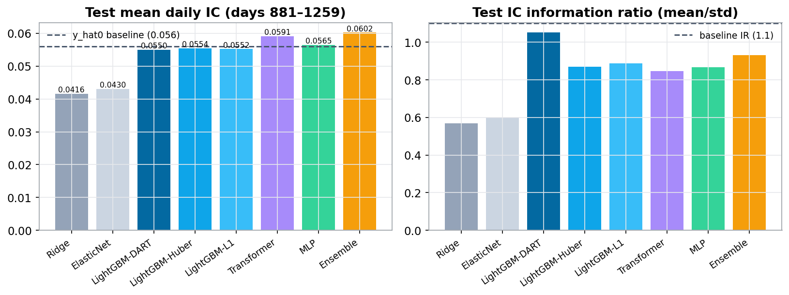
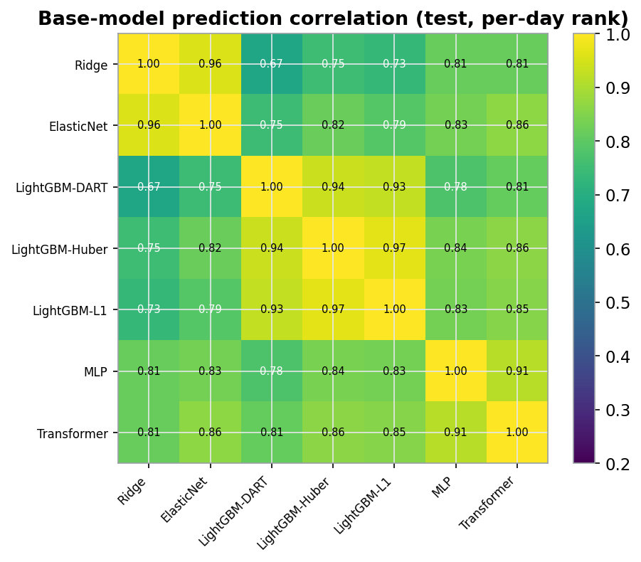
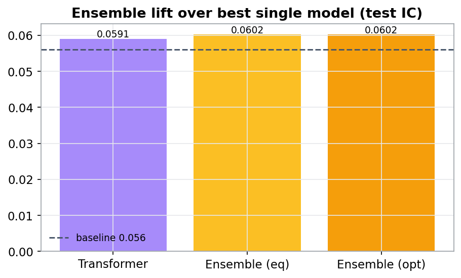

# eg-model — From Ridge / LightGBM / MLP Baselines to an Ensemble and a Temporal Transformer

Predicting a **weak forward return `y` on a cross-sectional daily panel** — the
Engineering Gates take-home — carried from linear baselines through a robust
ML ensemble to a v3-lineage **temporal Transformer**, under one leak-free,
forward-in-time validation protocol.

> 📄 **Read the full write-up (bilingual, self-contained):
> [https://autoalpha.cn/eg_model/](https://autoalpha.cn/eg_model/)**
> — task & data, feature engineering, the model ladder, the Transformer design,
> results, and the **Task 2** order-book / tick-signal answer. A static copy of
> the report is in this repo: [`summary.html`](summary.html).

The raw `data.csv` is intentionally **not** included (per the take-home NDA).

---

## Headline results (test = days 881–1259, the baseline's eval window)

Metric = **mean daily cross-sectional Pearson IC** (primary) and Spearman IC
(secondary), with the mean/std of daily IC (IR) as a stability check.

| Model | Pearson IC | Spearman | IR |
| --- | ---: | ---: | ---: |
| Reference baseline `y_hat0` | 0.0560 | — | 1.10 |
| Ridge / ElasticNet (linear) | ~0.0423 | ~0.048 | ~0.58 |
| LightGBM-L1 / Huber / DART (seed-bag) | ~0.0552 | ~0.059 | 0.87–**1.05** |
| MLP (multi-task, 6-seed) | 0.0565 | 0.0563 | 0.87 |
| **Temporal Transformer (v3 lineage, 8-seed)** | **0.0591** | 0.0576 | 0.85 |
| **ML Ensemble (robust equal-weight blend)** | **0.0602** | **0.0608** | 0.93 |

The single Transformer and the Ensemble both **beat the provided `y_hat0`** on the
primary metric (Ensemble **+7.5%** on Pearson IC, **+8.7%** on rank IC). Linear
models plateau at ~0.042, showing the extractable signal is **nonlinear /
interaction-based**.

<p align="center"></p>
<p align="center"><sub><b>Cross-model comparison (test).</b> Left: mean daily Pearson IC (dashed = baseline 0.056). Right: IC information ratio (dashed = baseline 1.1).</sub></p>

---

## Data & the metric

- **Panel.** `day` 1–1259 (time-ordered) × `instrument_id`; ≈1.68M rows, 1,333
  instruments, 74 groups (`g`, `-1` = unclassified). Near-rectangular: nearly every
  instrument on every day — which enables clean **per-instrument temporal sequences**.
- **Columns.** 86 anonymous factors `x_0…x_85`, 5 price columns `prc1…prc5`, a
  volume `vol0`, the group id `g`, and the target `y` (forward, mean ≈ 0).
- **Score.** `score = mean_d corr(y_hat[d], y[d])` — correlation **within each day**,
  averaged over days. Optimise the Pearson IC; keep it stable (IR).
- **Split.** train `1–760` / valid `761–880` (selection, early-stop) / test
  `881–1259` (scored once). `y_hat0` scores IC 0.056 / IR 1.1 on the test window.

## Feature engineering (213 leak-free features)

Because scoring is a per-day cross-sectional IC, the workhorse is the **per-day
cross-sectional z-score**. All temporal ops use `shift()>=0` within an instrument;
all cross-sectional ops use only the same day.

1. **CS z-score of all 86 `x`** (clip ±6) — removes per-day level/scale, the key denoiser.
2. **Temporal (per instrument):** `y` lags / rolling mean / rolling vol / EWMA; lag1 /
   5-day momentum / 10-day mean of the strongest 30 `x`'s.
3. **Price/volume:** `prc1…5` → mean/std/range/spread/skew & momentum; `vol0` change.
4. **Group (`g`):** lagged group return, and an **expanding-window target encoding**
   (up to the previous day — leak-free).
5. **Cross-sectional PCA (12)** — common factors that suppress idiosyncratic noise.

## Models

- **Linear** — Ridge / ElasticNet. Plateau ~0.042 ⇒ signal is nonlinear.
- **LightGBM** — robust **L1 / Huber / DART** objectives on the z-scored target,
  5-seed bagged. DART is the steadiest (IR 1.05).
- **MLP** — DCN-style cross + deep tower, **multi-task** heads (`y_xs` + `sign(y)` +
  `|y_xs|`), 6-seed, daily-IC early stopping.
- **Temporal Transformer** — per-`(instrument, day)` sequences of the last **K=32
  days**; v3-lineage (input projection + causal conv stem, **time-biased
  attention**, SwiGLU + LayerScale, last-token + attention dual readout, multitask
  head), 8-seed ensemble. The strongest single model and the most decorrelated from
  the trees.
- **Ensemble** — each model **per-day z-scored** (preserves Pearson IC; *not* ranked),
  LightGBM variants averaged into one family, then a **robust equal-weight blend** of
  {LightGBM, MLP, Transformer}. Equal weights beat valid-tuned weights across the
  valid→test regime shift.

<p align="center">
  
  
</p>
<p align="center"><sub>Left: base-model prediction correlation (Transformer↔LightGBM least correlated at 0.79). Right: ensemble lift over the best single model.</sub></p>

<p align="center"></p>
<p align="center"><sub>20-bucket monotonicity (test): realized mean <code>y</code> rises monotonically across prediction buckets — economically ordered alpha.</sub></p>

---

## Repository layout

| Path | Content |
| --- | --- |
| `tools/build_features.py` | leak-free feature pipeline → `artifacts/features.parquet` |
| `ML_single/scripts/` | `common.py` (IO + daily-IC metric), `run_classic.py` (Ridge/ElasticNet/LightGBM), `run_mlp.py` |
| `Transformer/v1/scripts/run_transformer.py` | v3-lineage temporal Transformer (v1 lineage; see `Transformer/review.md`) |
| `ML_ensemble/scripts/run_ensemble.py` | per-day z-score blend + weights |
| `tools/gen_figs.py` | report figures → `summary_assets/` |
| `summary_src.html` / `summary.html` | bilingual report (editable source / self-contained build) |
| `report/task2_section.html` | Task 2 — order-book / tick-signal answer |
| `artifacts/` | `panel_raw.parquet`, `features.parquet`, `preds/`, `metrics/` |
| `tools/build_new_factors.py` | 120-idea prc/vol factor mining + 3-round optimization + correlation pruning → `artifacts/new_factors.parquet` |
| `common_docs/new_factors_report.md` | full new-factor formula + per-round IC ledger |
| `*_nf.py` / `*_nf20.py` scripts | strict A/B retrain of the full stack on 213+111 (naive) vs. 213+20 (curated) features |

## Reproduce

```bash
cd /root/autodl-tmp/eg_model
python tools/build_features.py                 # 213 leak-free features
python ML_single/scripts/run_classic.py        # Ridge / ElasticNet / LightGBM
python ML_single/scripts/run_mlp.py            # multi-task MLP
NSEED=8 python Transformer/v1/scripts/run_transformer.py
python ML_ensemble/scripts/run_ensemble.py     # robust equal-weight blend
python tools/gen_figs.py                        # figures
```

`predict(df) -> y_hat` on new rows (same schema, `y` withheld): recompute features
→ score each model → per-day z-score → equal-weight blend.

---

## New Features — 100+ prc/vol factor ideas (§4 of the report)

`tools/build_new_factors.py` mines the raw `prc1…prc5` / `vol0` columns for **120
distinct economic/statistical ideas** (125 parameter variants), each pushed through a
uniform 3-round optimization ladder (raw z-score → processing → group-neutral /
residual-regression / classification-bucket optimization) and pruned for cross-idea
correlation (>0.8 dropped) down to **108 kept ideas / 111 factor columns**. Full
formulas + per-round IC ledger: [`common_docs/new_factors_report.md`](common_docs/new_factors_report.md).

Retraining the full stack (`*_nf.py` / `*_nf20.py` scripts, unmodified hyperparameters)
found an honest result: dumping all 111 factors in **dilutes** test IC (0.0602→0.0592,
noise from the many individually-weak columns), while truncating to the **top-20 by
train IC** (`tools/ablate_topk_factors.py`) holds IC ~flat (0.0602→0.0595) and lifts
**test IR from 0.931 to 1.106 (+18.8%)** — the new factors are decorrelated increments
that improve ensemble diversity, not standalone alpha, exactly as `feature_raw_data.md`
predicted. Production feature list: `artifacts/feature_list_nf20.json`.

---

## Task 2 — order-book & tick signals

The open-ended Task 2 (deriving tick/minute signals from L2 book + message stream to
forecast 30-minute forward mid-price return) is answered in §6 of the report —
order-flow imbalance / microprice / cancel-toxicity / Hawkes intensity, the
event-vs-clock-time feature pipeline, deep-book (levels 2–10) exploitation,
trade/add/cancel decomposition, and leakage-safe validation — all bridging back into
this same cross-section + temporal modelling stack.
